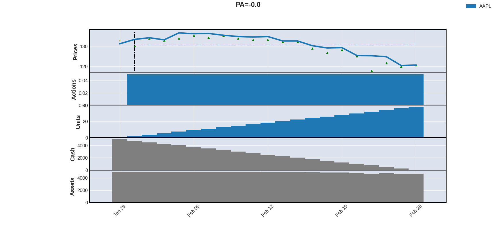
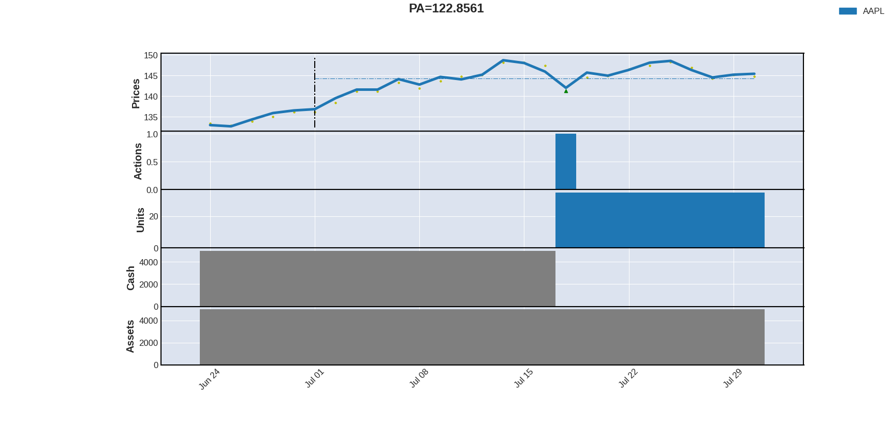
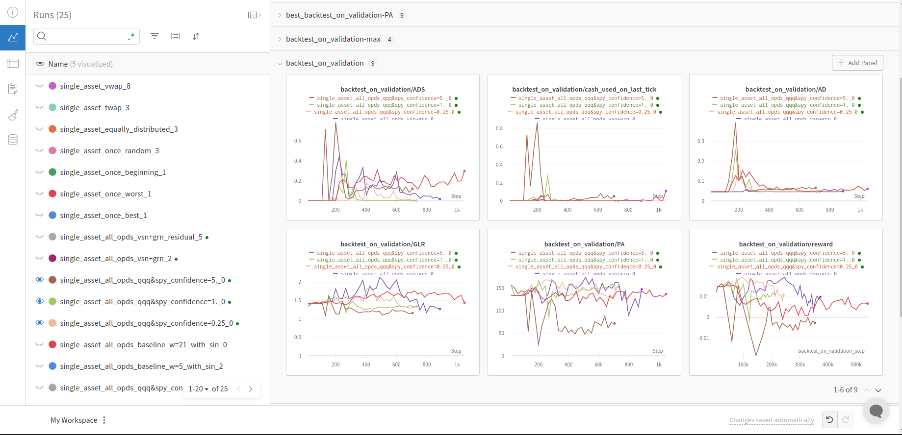

# Yet Another Charming Trader - Yacht - Introduction
A Deep Reinforcement Learning framework for trading & order execution in financial markets. The goal of the project
is to speed up the development & research of financial agents. The code has components for:
* Loading & preprocessing data directly from the internet
* Training & evaluating deep reinforcement learning agents
* Use specific financial metrics or easily implement your own
* Visualizing the performance of the agent with some intuitive graphs

The nice part is that everything is `configurable` within a config file.
<br> The code is using popular packages like:
* pytorch
* pandas
* stable-baselines3
* gym
* wandb
* mplfinance

Relative to other repositories, with the same scope, on this one a lot of focus 
was on researching better components:
* Preprocessing methods to make data stationary
* Training methods: Supervised heads, Teacher Oracles etc.
* Different models: Recurrent, Transformers etc.

# Project Architecture

<br><br>The architecture is split into 4 main categories:
* Data
* Environment
* Reinforcement Learning Agents
* Specific Task Layer

The `Specific Task Layer` is a glue code module that is used for training & backtesting.
It can be further be extended into the `applicaton layer`.

# Visual Representations
Visual representations of the actions taken by the agent & the current status of the agent.




# Install
### Requirements
* Code tested with `Python 3.8`, `pytorch 1.8.1`, `cuda 11.1` & `cudnn 8.0` on `Ubuntu 20.04`
* Within a `conda` environment run:
```shell
pip install -r requirements.txt
```
* Install torch separately with:
```shell
pip install torch==1.8.1+cu111 -f https://download.pytorch.org/whl/torch_stable.html
```

### Config Compiler
* The configuration system is built upon `proto bufs`. If you want to recompile / change the proto bufs files,
you should install the `protoc` compiler on your system:
```shell
sudo apt  install protobuf-compiler
```
* The `compilation` command is running from the root folder:  
```shell
  protoc -I=. --python_out=. yacht/config/proto/*.proto
  ```

### Add Secret Keys
* Create a file called `.env` at the root directory level. If you want to fully use the market APIs and
experiment trackers you should add the secret keys.
* Look at `.env.default` for the supported env vars.

# Run
All the supported configs can be found at `./yacht/config/configs`. 
You should only add the config path relative to it.

### Train
```shell
python main.py train --config-file order_execution/all/single_asset_all_opds_silent.config.txt --storage-dir ./storage/opds
```
### Backtest
```shell
python main.py backtest --config-file order_execution/all/single_asset_all_opds_silent.config.txt --storage-dir ./storage/opds
```
### Resume
```shell
python main.py train --config-file order_execution/all/single_asset_all_opds_silent.config.txt --storage-dir ./storage/opds --resume-from latest-train
```
For the parameter `--resume-from` we support the following combinations:
* Absolute path to the checkpoint.
* `latest-train` = resume the agent from the latest checkpoint saved during training
* `best-train` = resume the agent from the best checkpoint saved during training

**NOTE:** For the `best-train` parameter you can choose a specific metric for which you consider an agent to be the best. You
can do that with the `meta.metrics_to_load_best_on` config parameter. For example `metrics_to_load_best_on: ['PA', 'GLR']`
will load two agents: The one which performed the best on the metric `PA` & the one which performed the best on `GLR`.

# Experiment Tracking
### Weights & Biases
* For now, we support `wandb` for experiment tracking and logging.
* Just add the api key in the `.env` file. Also, in the configuration file you should add:
```shell
meta: {
  experiment_tracker: 'wandb'
}
```
Here is an example of how it looks:

* If you don't want to log a specific experiment on the experiment tracker just remove the config
field or replace it with the empty string `''`.

# Hyperparameter Optimization
### Weights & Biases
* We support yyperparameter optimization with weights & biases sweeps.
* Weights & biases should work as a simple experiment tracker before using this.
* You can use any other config from `tools/tuning/configs` or generate your own.
```shell
wandb sweep tools/tuning/configs/single_asset_order_execution_crypto.yaml
wandb agent id-given-by-generated-sweep
```

# Data APIs
* Currently we have support for:
  * `Binance`
  * `Yahoo Finance`.
* You should set the `api keys` in the `.env` file for full support.

# Datasets & Download Data
* S&P 500
* Dow 30
* Nasdaq 100
* Russell 2000

You can set `tickers: ['NASDAQ100']` in the configuration file and all the tickers from the index will be expanded.
You can also set something like `['NASDQ100', 'RUSSELL2000', 'AAPL']` or any combination you like.
#### Download
We cache the data in `h5` files.
```shell
python main.py download --config-file-name download_4years.config.txt --storage-dir ./storage/download_4_years --market-storage-dir ./storage/download_4_years
```
* The `--market-storage-dir` CLI argument is optional. If you add it the market will be placed
in a different location than your `storage-dir`. This is helpful because it can be accessed by multiple
experiments in parallel `during training` (the `h5` file will be set in a read only mode). Otherwise, while training,
only one experiment can access a specific file. 
* `--market-storage-dir` should be used also during `training` & `backtesting`
* You can use the `market_mixins: [...]` to preprocess the data before it is cached.


# More Resources
For further reading go to:
* [Available Components](docs/components.md)
* [Config Explanation](docs/config.md)
* [Trading](docs/trading.md)
* [Order Execution](docs/order_execution.md)
* [Metrics](docs/metrics.md)
* [Teacher](docs/teacher.md)
